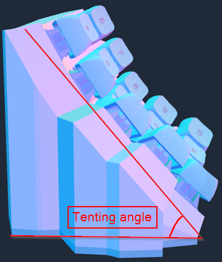
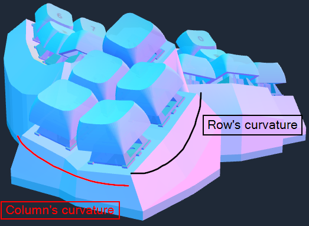

# Configuration

## Modes
There are three modes for the configuration. This documentation is written for the Advanced mode.

### Basic
Only shows the most used configuration options.

### Advanced
Shows most things, that you'll need to create your keyboard.

### Expert
Allows to edit the code directly, to enable even more possibilities. See [expert mode](expert.md) for that.

## General
Some setting groups allow you to edit the vaues for one side of the keyboard. When you edit want to edit them together, the values of the left half will be overridden by the values of the right half.

## Upper keys
This section steers the general look / layout of the keyboard.

With the buttons, you can select the amount of rows and columns of your keyboard. The amounts of rows generally applies to the middle- and ringfinder columns, the index finger and pinky rows will have a row less. Ø removes the keys and only leaves the thumb cluster.

The keycap and switch settings work the same as [the ones in the edit key menu](editor-basics.md#switch-and-keycap-size).

The horizontal and vertical spacing do the following:

## Curvature

## Thumb cluster
With the buttons, you can cycle through a few preset thumb clusters. You can also remove the thumb cluster with Ø.
If you want to make a custom thumb cluster, choose one of the presets and then edit the keys manually. If you need more keys on the thumb cluster, make sure to select a thumb cluster key to [add a new one](editor-basics.md#adding-keys) to keep the clusters.

The curvature can be adjusted and changes the angle of the keys like with the keywell. This option only changes some thumb clusters, other presets are unaffected.

