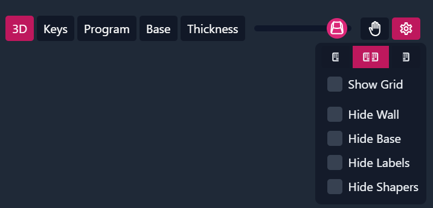
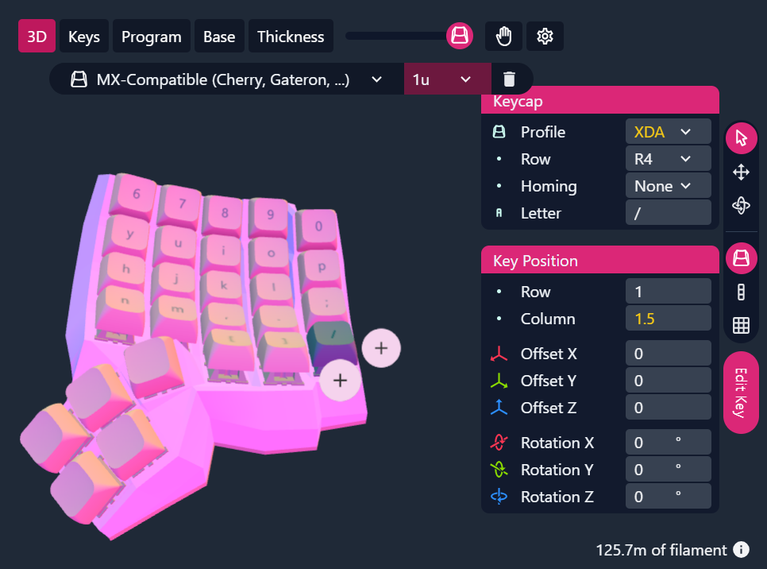
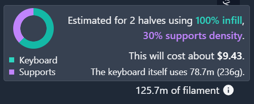

# Editor basics

## Tools

There are three tools at your disposal. They can be chosen on the right side of the preview.

{ autoplay }

## Key selection modes

There are three ways to select key. They can be chosen on the right side below the tools.

{ autoplay }

## Views

There are a couple of different views. These can be selected above the preview.

### 3D view

This is the standard view. It shows you your keyboard.

### Keys view

TODO

### Program view

This view shows you how you could wire the keyboard and lets you download the KLE Layout.

### Base view

This view shows you the base of the keyboard with the screw locations for the baseplate and the board holder.

### Thickness view

This view shows you, how thick the shell is in certain places, and where it might be too thin.

## Opacity slider

This slider changes the opacity of the keys and the baseplate. You can check, how your shell and the microcontroller look here.

{ autoplay }

## Hand scanning
Allows you to [scan your hand](hand-scans.md), to show or hide your hand scan and to [fit the keyboard to your hand](hand-fitting.md).

**Todo** describe how to scan the hand in greater detail

## Settings

### Keyboard visibility
The buttons allow you to show the left, right or both halves.

### Show grid
Shows a grid. Each line is 1cm from the next. **Todo confirm spacing**

### Hide wall
Hides the walls of the keyboard, but not the top plate.

### Hide base
Hides the base plate and the microcontroller-holder.

### Hide labels
Hides the letters on the keycaps.

### Hide shapers
**Todo**

## Edit key

### Switch and keycap size
With the bar at the top, you can select which switch you are using, and the keycap size. You can also delete the key here.

### Keycap
#### Profile
Allows you to select, what profile the keycap uses.

#### Row
Some keycap profiles have different keycaps for different rows to be more comfortable.

#### Homing
**Todo** doesn't seem to make any visual difference?

#### Letter
The letter to be shown on this keycap

### Key position
The row and column allow you to align the keys to the grid.
The offset offsetts the keys from the position given by the row and column.
The rotation rotates the key in it's position. The rotation set in the curvature panel is not shown here.
**Todo link to the curvature panel**

## Filament information

Shows you how much filament printing your keyboard would take.
The cost estimation seems to be based on a price of about 40$ per kilogram.
